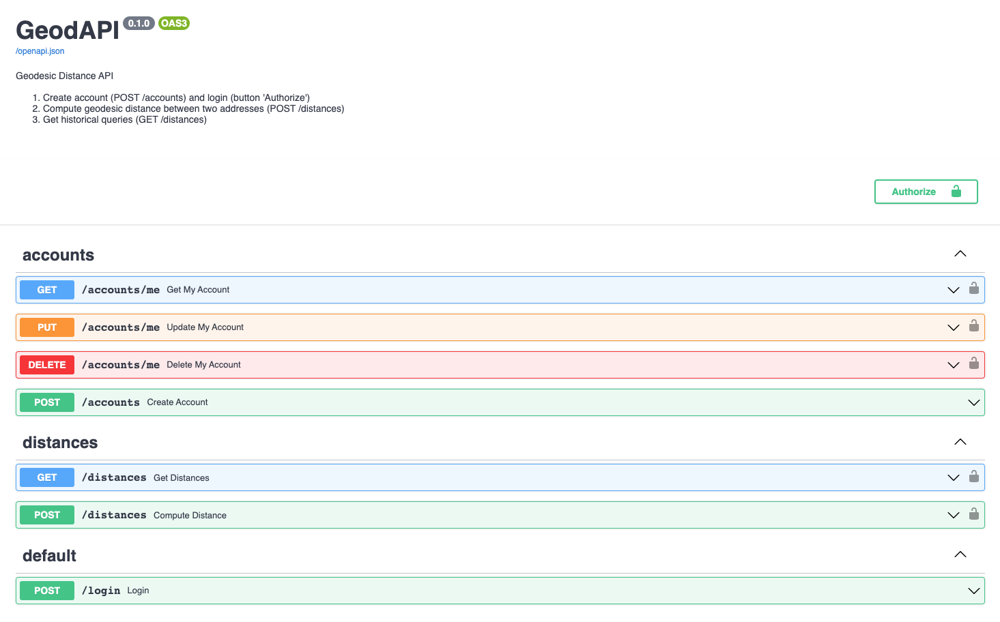

# Geodesic Distance API

Given two addresses (street, house number, city, and country), the [GeodAPI](https://geodapi.herokuapp.com/) computes the geodesic distance between them.

It uses the [Nominatim](https://nominatim.org/release-docs/develop/api/Search/) search service to retrieve the addresses' latitude and longitude and [GeoPy](https://geopy.readthedocs.io/en/stable/) to calculate the geodesic distance between the two locations.



## Dev

- Requirements: python-3.8.9, docker, make
- Create and activate virtual environment
```
python3 -m venv venv
source venv/bin/activate
```
- Run tests (there are other test targets in the Makefile)
```
make test
```

### Local

- Run the application
```
make runapp
```

### With Docker

- Build docker image geodapi
```
make build
```
- Adjust environment section of service api in the file docker-compose.dev.yaml
```
    environment:
      - PWD_HASHING=passlib         # Choose password hashing [fake|passlib]
      - DB_ACCOUNTS=redis           # Choose database for accounts [inmem|redis]
      - DB_DISTANCES=redis          # Choose database for distances [inmem|redis]
      - REDIS_HOST=redis            # Host of redis server instance
      - SEARCH_SERVICE=nominatim    # Choose search service plugin [fake|nominatim]
      - DISTANCE_SERVICE=geopy      # Choose distance service plugin [fake|geopy]
```
- Run multi-container Docker application (geodapi + redis)
```
make cup
```

## Download and Go

- Build image
```
make build
```
- Deploy the application
```
bash geodapi.sh [start|stop|kill|restart]
```
